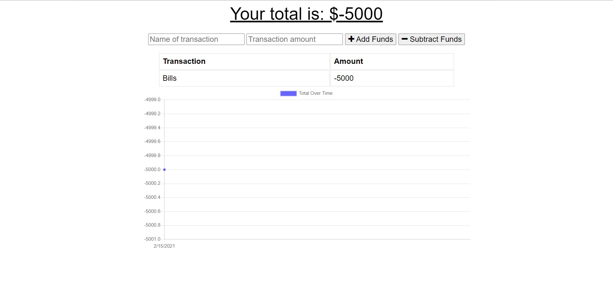

# BudgetTracker

---

## Description

As a busy traveller, a budget can be maintained by recording and tracking transactions while on the road. Even when offline without internet access a user is still able to enter withdrawals and deposits within the application so that your budget stays up to date.

## Goals

1. Create entries of transactions, both withdrawals and deposits.
2. Provide a chart/graph to show spending trends
3. Persist transactions through the database even without an internet/data conneciton
4. A screenshot and link are provided to preview the application

 
[Budget Tracker]()

## Technology Used

- MongoDB
- Compression
- Express
- Javascript

## Table of Contents

[Installation](#installation) 
[Usage](#usage) 
[Contributions](#contributions) 
[Description](#description) 

## Installation

N/A

## Usage

Track your budgets of deposits and expenses while travelling with offline capability

## Contributions

Jon Keopangna

## Testing

N/A

## License

 
For more information use the link provided.

## Contact For Questions

Github: [Jkeopangna](https://github.com/jkeopangna/BudgetTracker) 
Email: [Jkeopangna@gmail](https://gmail.com)
